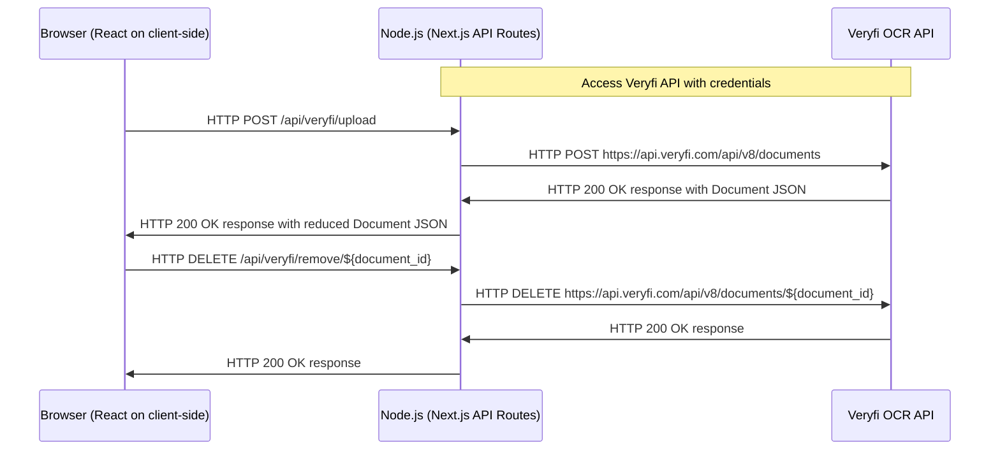

# OCR Geocoding UI

This project leverages [Veryfi OCR API](https://www.veryfi.com/products/ocr-api-platform/) for parsing receipts, getting geo cordinates for receipts addresses and building a heatmap of expenses.

## Running locally in development mode

To get started, just clone the repository and run `yarn install && yarn dev`

```
git clone https://github.com/tx44/ocr-geocoding-ui
yarn install
yarn dev
```

You also need to create `.env` file in the project root directory and set credentials from your Veryfi API account:

```
VERYFI_CLIENT_ID={{YOUR_VERYFI_CLIENT_ID}}
VERYFI_CLIENT_SECRET={{YOUR_VERYFI_CLIENT_SECRET}}
VERYFI_USERNAME={{YOUR_VERYFI_USERNAME}}
VERYFI_API_KEY={{YOUR_VERYFI_API_KEY}}
```

After starting development server by `yarn dev`, app will be available locally at 3000 port: `open http://localhost:3000`

## How to use?

To visualize a heat map of expenses, you need to attach a bunch of receipts to dropzone below the map.

It uploads all receipts to Veryfi API and extracts useful data on it: geo coordinates and total sum. By first, we can set points for heatmap, by second - vary the intensity parameter of each point.

You can get testing images of receipts in `data/receipts` directory. Please note, that Veryfi API has a limit of 50 uploads per month for a free account. For heatmap visualization, this is not a very large number, so we recommend attaching all 25 testing images. Some of them (1001-receipt.jpg, 1008-receipt.jpg, etc...) are not have any address to convert them into geo coordinates, so we inform it in UI with inline error "Can't extract data of vendor's coordinates". You can get "Error on calling Veryfi API" error message near file name on processing when.

Testing receipt images are part of [The ExpressExpense SRD (sample receipt dataset for machine learning) of restaurant receipts](https://expressexpense.com/blog/free-receipt-images-ocr-machine-learning-dataset/).

## Veryfi: useful sources

https://www.veryfi.com/nodejs/

https://app.veryfi.com/api/docs/

## Tech inside

-   ⚡️ Next.js 13
-   ⚛️ React 18
-   ✨ TypeScript
-   💨 Tailwind CSS 3 — Configured with CSS Variables to extend the **primary** color
-   🃏 Jest — Configured for unit testing
-   📈 Absolute Import and Path Alias — Import components using `@/` prefix
-   📏 ESLint — Find and fix problems in your code, also will **auto sort** your imports
-   💖 Prettier — Format your code consistently
-   🐶 Husky & Lint Staged — Run scripts on your staged files before they are committed
-   🤖 Conventional Commit Lint — Make sure you & your teammates follow conventional commit
-   ⏰ Standard Version Changelog — Generate your changelog using `yarn release`
-   👷 Github Actions — Lint your code on PR

## Sequence diagram


